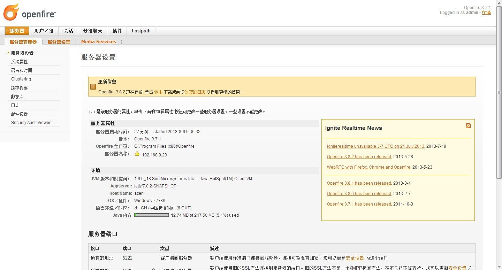
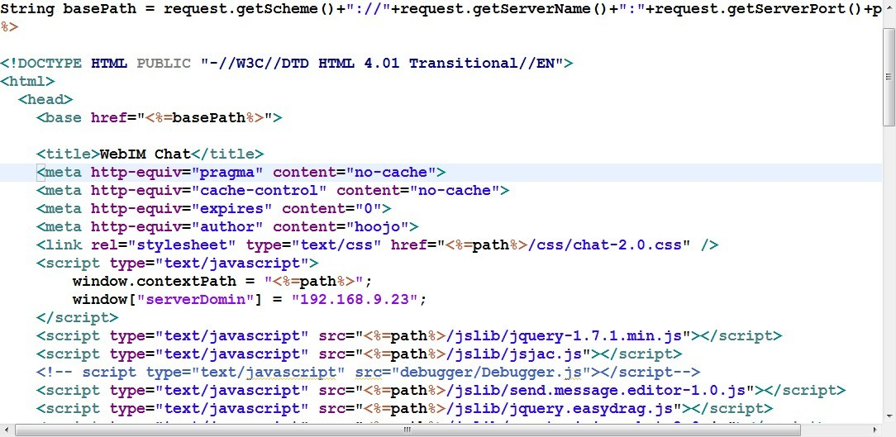
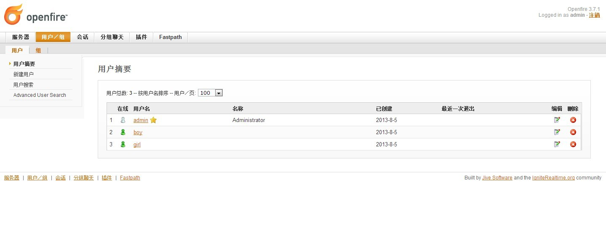
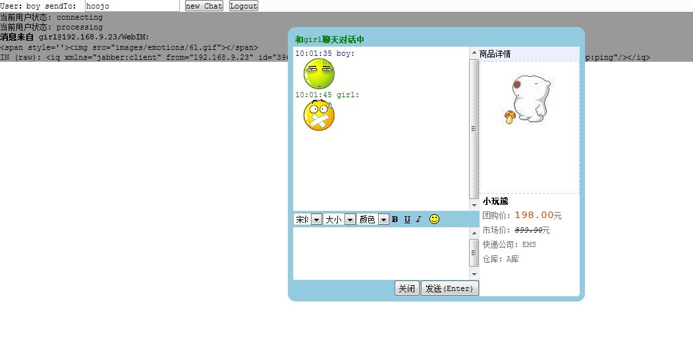

JavaScript/jQuery、HTML、CSS 构建 Web IM 远程及时聊天通信程序
===============================================================

1 安装openfire_3_7_1.exe

2 修改服务器名称:192.168.9.23(openfire所在机器的ip地址)

3 修改index.jsp中的window["serverDomin"] = "192.168.9.23";

4 在openfire的管理控制台中注册用户

5 部署工程,启动Tomcat,登录实现互聊。

参考:

[http://www.cnblogs.com/hoojo/archive/2012/08/13/2635779.html](http://www.cnblogs.com/hoojo/archive/2012/08/13/2635779.html)